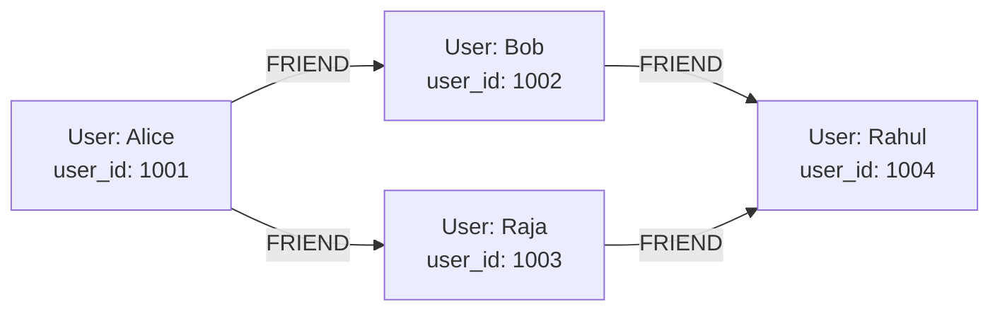
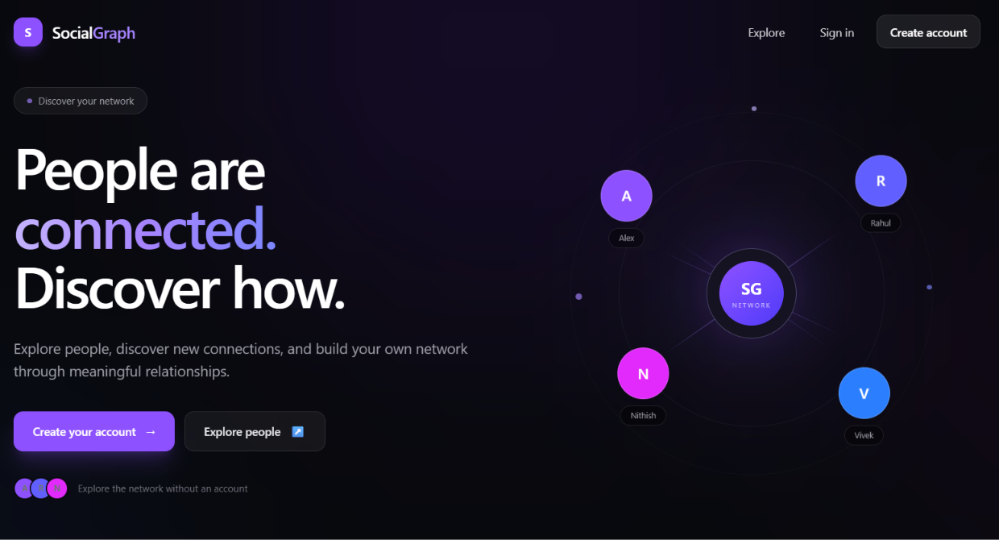
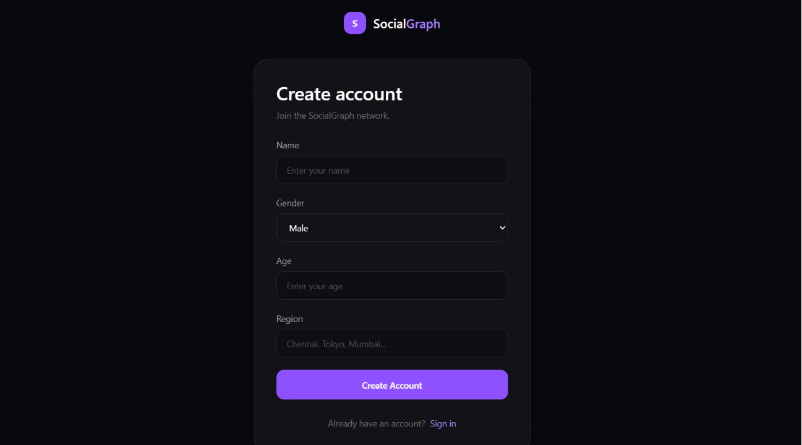
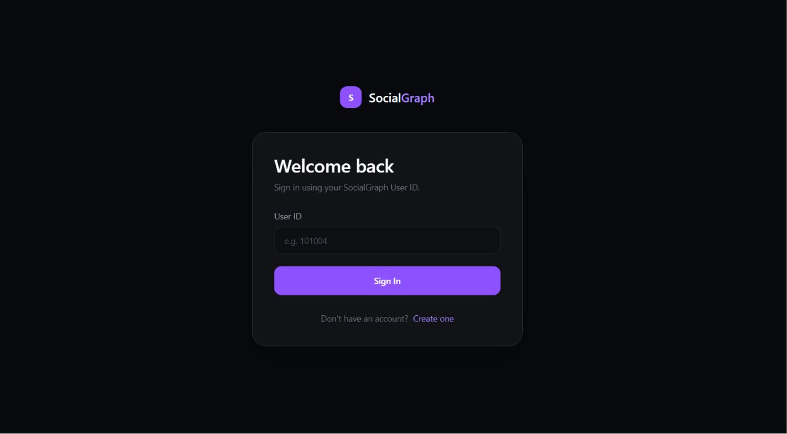
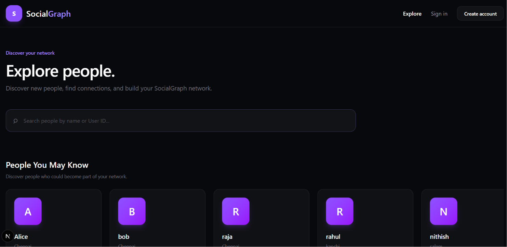
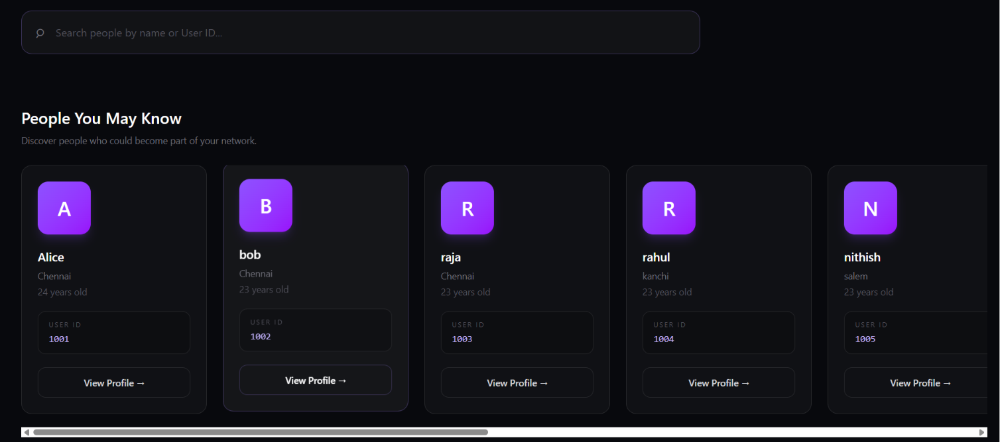
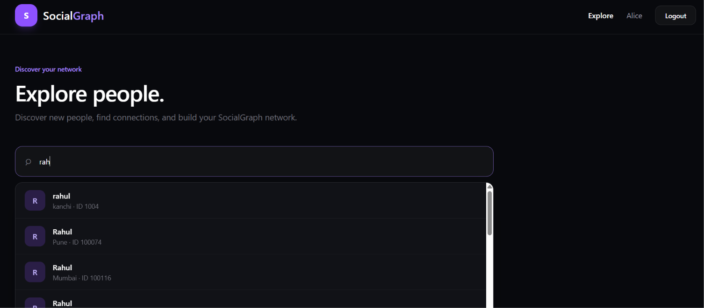
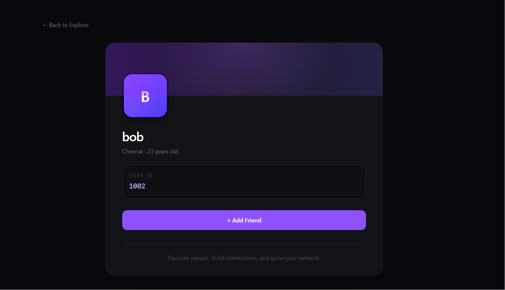
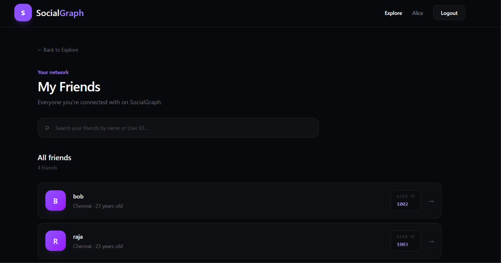

# SocialGraph

SocialGraph is a graph-based social networking application built with **CognoDB** as the graph database layer.

The application allows users to:
- Create an account and receive a generated User ID
- Sign in using their User ID
- Search users by name or User ID
- Explore people in the network
- View user profiles
- Add friends
- Check friendship status
- View their friends
- Discover people through their existing network
- Receive recommendations based on graph relationships

## 1. Use Case

### Social network discovery and relationship exploration

SocialGraph focuses on a real-world problem where the important information is not only the users themselves, but the **relationships between users**.

The application answers questions such as:
- Who are my friends?
- Who are my friends' friends?
- Who could I potentially know?
- Is this person already my friend?
- Which people are connected to my network?

Example:

```text
Alice
  |
  +-- FRIEND --> Bob
  |               |
  |               +-- FRIEND --> Rahul
  |
  +-- FRIEND --> Raja
```

Rahul can therefore be discovered as a potential recommendation for Alice through a two-hop relationship.

The application is centered around **connections and relationship traversal**, rather than treating users as independent rows.

## 2. Why a Graph Database?

SocialGraph uses a graph database because relationships are a fundamental part of the application's functionality.

The core model is:

```text
(:User)-[:FRIEND]->(:User)
```

A relational database could store users and friendships using tables, but multi-level relationship operations would require repeated self-joins on a friendship table.

For example, the **People You May Know** feature performs a two-hop traversal:

```text
User
  |
 FRIEND
  v
Friend
  |
 FRIEND
  v
Friend of Friend
```

In Cypher:

```cypher
MATCH (u:User {user_id: $userId})
      -[:FRIEND]->()
      -[:FRIEND]->(recommendation:User)
RETURN DISTINCT recommendation
LIMIT 10
```

The relationship traversal is expressed directly. As traversal depth and relationship-based features grow, the graph model remains natural while a relational implementation would require increasingly complex self-joins.

Therefore, the graph database is not being used merely as a different storage mechanism. **Relationship traversal is a core operation of SocialGraph.**

## 3. Technology Stack

### Backend
- Java
- Spring Boot
- Maven
- Official Neo4j Java Driver
- openCypher
- CognoDB

### Frontend
- Next.js
- React
- JavaScript
- Tailwind CSS

### Database
- CognoDB Cloud
- `(:User)` nodes
- `[:FRIEND]` relationships

CognoDB supports openCypher over Bolt and works with the official Neo4j drivers. SocialGraph uses the official Neo4j Java Driver.

## 4. Architecture

```text
+-----------------------------+
|       Next.js Frontend      |
|                             |
| Home / Login / Explore      |
| Profile / Friends           |
+-------------+---------------+
              |
              | HTTP / REST
              v
+-----------------------------+
|       Spring Boot API       |
|                             |
| Controller                  |
|      |                      |
|    Service                  |
|      |                      |
|  Repository                 |
+-------------+---------------+
              |
              | Neo4j Java Driver
              | Parameterized Cypher
              v
+-----------------------------+
|          CognoDB            |
|                             |
|        (:User)              |
|           |                 |
|        FRIEND               |
|           |                 |
|        (:User)              |
+-----------------------------+
```

Backend layering:

```text
Controller
    |
Service
    |
Repository
    |
CognoDB
```

## 5. Graph Data Model

### User node

```text
(:User)
```

Properties:

| Property | Description |
|---|---|
| `user_id` | Unique user identifier |
| `name` | User name |
| `gender` | User gender value |
| `age` | User age |
| `region` | User region |
| `source` | Application or dataset source |

### FRIEND relationship

```text
(:User)-[:FRIEND]->(:User)
```

### Diagram



This model makes direct and multi-hop relationships explicit.

## 6. Data and Seed Data

The application uses realistic social-network data containing:

- `User ID`
- `Name`
- `Gender`
- `Age`
- `Region`
- `Source`

### Seed Data

The seed data is included in the repository under:

```text
data/
└── benchmark/
    ├── users.csv
    └── relationships.csv
```
### Loading Data into CognoDB

The seed data was loaded into CognoDB using the CognoDBLoader.java
loader located in:
```text
 src/main/java/com/social/graphapp/config/CognoDBLoader.java
```

## 7. Main Cypher Queries

All database operations use Cypher through the official Neo4j Java Driver.

### 7.1 Search users

```cypher
MATCH (u:User)
WHERE toLower(u.name) CONTAINS toLower($query)
   OR toString(u.user_id) STARTS WITH $query
RETURN u
LIMIT 20
```

Supports search by name and User ID using the `$query` parameter.

### 7.2 Get a user

```cypher
MATCH (u:User {user_id: $userId})
RETURN u
```

### 7.3 Get friends

```cypher
MATCH (u:User {user_id: $userId})
      -[:FRIEND]->(friend:User)
RETURN friend
```

### 7.4 Check friendship

```cypher
MATCH (u:User {user_id: $userId})
MATCH (f:User {user_id: $friendId})
RETURN EXISTS((u)-[:FRIEND]->(f)) AS friends
```

The result determines whether the profile displays `Add Friend` or `Already a Friend`.

### 7.5 Add friend

```cypher
MATCH (u:User {user_id: $userId})
MATCH (f:User {user_id: $friendId})
WHERE u <> f
MERGE (u)-[:FRIEND]->(f)
RETURN u, f
```

`MERGE` prevents unnecessary duplicate relationships.

### 7.6 Multi-hop friend recommendation

```cypher
MATCH (u:User {user_id: $userId})
      -[:FRIEND]->()
      -[:FRIEND]->(recommendation:User)
RETURN DISTINCT recommendation
LIMIT 10
```

This is the main graph-oriented recommendation query:

```text
Current User
     |
   FRIEND
     v
   Friend
     |
   FRIEND
     v
Friend of Friend
```

The application uses this relationship structure for the **People You May Know** feature.

### 7.7 Visitor discovery

Visitors do not have a user ID, so:

```text
GET /api/users/discover
```

returns random public users.

Logged-in users can request:

```text
GET /api/users/discover?userId=1001
```

and receive network-based discovery/recommendation results.

## 8. Parameterized Queries

The application uses parameters with the official Neo4j Java Driver.

Example:

```java
var result = session.run(
        cypher,
        Map.of(
                "userId", userId,
                "friendId", friendId
        )
);
```

User input is not concatenated into Cypher.

For example, the application uses:

```cypher
MATCH (u:User {user_id: $userId})
```

rather than constructing a query by concatenating `userId`.

## 9. Application Features

### Home
Visitors can:
- Create an account
- Sign in
- Explore the network

Authenticated users see navigation appropriate to their session, including Explore and Logout.

### Account creation
Users provide:
- Name
- Gender
- Age
- Region

The backend generates a User ID. The ID is displayed after account creation so the user can save it for future sign in.

### Sign in
The current application uses the generated User ID as the sign-in identifier.

```text
GET /api/users/{userId}
```

An invalid User ID produces a user-readable error.

### Explore
Users can:
- Search by name
- Search by User ID
- View People You May Know
- View their friends
- Open profiles

Visitors can explore public users but relationship actions require an account.

### Profile
A profile displays:
- Name
- Region
- Age
- User ID
- Friendship status

The friendship action is shown as either:
- `+ Add Friend`
- `Already a Friend`

### Friends
Authenticated users can:
- View friends in Explore
- Open friend profiles
- Open a dedicated View All Friends page

## 10. UI/UX

The application is designed for a non-technical user and includes:
- Consistent navigation
- Responsive layouts
- Loading states
- Empty states
- Error states
- Search
- Profile navigation
- Authentication-aware navigation
- Friendship status feedback
- Readable typography

Examples:

```text
You don't have any friends yet.
```

and:

```text
No people to discover right now.
```

Loading placeholders are displayed while data is being retrieved.

## 11. Error Handling

The application handles common API/database failures without exposing database credentials.

Examples:
- Invalid User ID
- User not found
- Failed API requests
- Empty recommendation results
- Empty friend lists
- Database connectivity failures

The frontend displays readable error or empty states.

## 12. Project Structure

```text
SocialGraph/
│
├── README.md
├── .gitignore
│
├── docs/
│   └── screenshots/
│
├── graphapp/                         # Spring Boot Backend
│   │
│   ├── pom.xml
│   ├── mvnw
│   ├── mvnw.cmd
│   │
│   └── src/
│       ├── main/
│       │   ├── java/
│       │   │   └── com.social.graphapp/
│       │   │       │
│       │   │       ├── GraphappApplication.java
│       │   │       │
│       │   │       ├── config/
│       │   │       │   └── CognoDBConfig.java
|       |   |       |   └── CognoDBConfig.java
|       |   |       |   └── CorsConfig.java
│       │   │       │
│       │   │       ├── controller/
│       │   │       │   └── UserController.java
│       │   │       │
│       │   │       ├── model/
│       │   │       │   ├── User.java
│       │   │       │   └── CreateUserRequest.java
│       │   │       │
│       │   │       ├── repository/
│       │   │       │   └── UserRepository.java
│       │   │       │
│       │   │       └── service/
│       │   │           └── UserService.java
│       │   │
│       │   └── resources/
│       │
│       └── test/
│
└── frontend-graphapp/                # Next.js Frontend
    │
    ├── package.json
    ├── package-lock.json
    ├── next.config.mjs
    ├── jsconfig.json
    ├── eslint.config.mjs
    ├── postcss.config.mjs
    ├── .gitignore
    ├── Dockerfile
    │
    ├── public/
    │
    └── src/
        └── app/
            │
            ├── page.js               # Home
            ├── layout.js
            ├── globals.css
            ├── favicon.ico
            │
            ├── create/
            │   └── page.js
            │
            ├── login/
            │   └── page.js
            │
            ├── explore/
            │   ├── page.js
            │   │
            │   └── friends/
            │       └── page.js
            │
            └── profile/
                └── [userId]/
                    └── page.js
```


## 13. Environment Variables

Database credentials are never committed to GitHub.

### Backend

```env
COGNODB_URI=bolt+s://<instance-id>.databases.cognodb.cloud
COGNODB_USERNAME=cognodb
COGNODB_PASSWORD=<your-password>
```

### Frontend

```env
NEXT_PUBLIC_API_URL=http://localhost:8080/api/users
```

For production:

```env
NEXT_PUBLIC_API_URL=https://socialgraph-backend.onrender.com/api/users
```

Actual credentials must never be placed in README, source code or committed `.env` files.

## 14. CognoDB Setup

### Step 1 - Create an account

Create a CognoDB Cloud account:

https://console.cognodb.com/signup

### Step 2 - Create a free instance

Create a free `c0` instance and choose a region.

### Step 3 - Save connection details

CognoDB provides a URI similar to:

```text
bolt+s://<instance-id>.databases.cognodb.cloud
```

The generated password for the `cognodb` user is shown once, so save it securely.

### Step 4 - Configure the backend

Set:

```env
COGNODB_URI=bolt+s://<instance-id>.databases.cognodb.cloud
COGNODB_USERNAME=cognodb
COGNODB_PASSWORD=<saved-password>
```


### Free-tier considerations

The assignment specifies the free `c0` instance as:
- 0.5 vCPU burstable
- 256 MB RAM
- 1 GB disk
- Up to 200 connections

The dataset is sized appropriately for demonstrating the use case.

## 15. Running Locally

### Prerequisites

- Java 25
- Maven
- Node.js
- npm
- CognoDB Cloud instance

### Clone the repository and navigate into the project:

```bash
git clone https://github.com/<your-github-username>/Socialgraph.git
cd Socialgraph
```

### Backend

```bash
cd graphapp
mvn spring-boot:run
```

Backend:

```text
http://localhost:8080
```

### Frontend

```bash
cd frontend-graphapp
npm install
npm run dev
```

Frontend:

```text
http://localhost:3000
```

## 16. API Overview

| Method | Endpoint | Purpose |
|---|---|---|
| `POST` | `/api/users` | Create user |
| `GET` | `/api/users/{userId}` | Get user |
| `GET` | `/api/users/search?query=...` | Search users |
| `GET` | `/api/users/discover` | Visitor discovery |
| `GET` | `/api/users/discover?userId=...` | Logged-in discovery |
| `GET` | `/api/users/{userId}/friends` | Get friends |
| `GET` | `/api/users/{userId}/friends/{friendId}/status` | Check friendship |
| `POST` | `/api/users/{userId}/friends/{friendId}` | Add friend |


## 17. Screenshots

Add the final screenshots under:

```text
docs/screenshots/
```

Recommended files:

```text
home.png
create-account.png
login.png
explore-visitor.png
explore-user.png
profile.png
friends.png
```

Then include them here:

### Home



### Create Account



### Login



### Explore




### Search friends



### Profile



### Friends



## 18. Hosted Demo

### Live Application

**Frontend:**  
https://socialgraph-frontend.vercel.app/

**Backend:**  
https://socialgraph-backend.onrender.com/

### Initial Access

The backend is hosted on Render using a free instance. When the backend has been inactive for some time, the service may enter a sleep state and require a short startup period when accessed again.

Before accessing the frontend for the first time, verify that the backend is running by opening:

https://socialgraph-backend.onrender.com/api/users/discover

The endpoint should return the SocialGraph user data in JSON format. Once the backend is active, access the frontend application:

https://socialgraph-frontend.vercel.app/

The frontend communicates with the hosted Spring Boot backend, which connects to CognoDB using environment-configured credentials.

### Deployment Architecture

```text
Vercel
SocialGraph Frontend
        |
        | REST API
        ↓
Render
Spring Boot Backend
        |
        | Neo4j Java Driver
        ↓
CognoDB
```

## 19. Screen Recording

**Demo Recording:** https://drive.google.com/file/d/1egkEoJOW16yXydpKjYe3uyq_9g3u3HKf/view?usp=sharing

The recording demonstrates the main SocialGraph user flow, including account creation, sign in, user discovery, search, profiles, adding friends, and viewing friends.


## 20. Assignment Requirements Checklist

| Assignment requirement | SocialGraph implementation |
|---|---|
| Real-world use case | Social network discovery and relationship exploration |
| "Why a graph database?" | Section 2 |
| Thoughtful graph data model | `(:User)` and `[:FRIEND]` |
| Labeled nodes | `User` |
| Typed relationships | `FRIEND` |
| Properties | `user_id`, `name`, `gender`, `age`, `region`, `source` |
| Simple data model diagram | Mermaid diagram in Section 5 |
| Realistic seed data | `data/` |
| Data-loading script | `CognoDBLoader.java` |
| Cypher queries | `UserRepository.java` / Section 7 |
| Multi-hop traversal | Friend-of-friend recommendation |
| Relationally awkward query | Two-hop social-network traversal |
| Parameterized queries | Neo4j Java Driver parameters |
| Functional web application | Next.js + Spring Boot |
| Non-technical UX | Home, Explore, Profile, Friends |
| Clean UI/UX | Tailwind CSS |
| Loading states | Explore/Friends |
| Empty states | Explore/Friends |
| Environment variables | CognoDB credentials |
| Secrets excluded from repository | `.gitignore` / environment configuration |
| Clear project structure | Frontend + layered backend |
| Graceful error handling | Backend/frontend error states |
| Full source code | Frontend + Spring Boot backend + seed data + loader |
| CognoDB setup instructions | Section 14 |
| Main queries explained | Section 7 |
| UI screenshots | Section 17 |
| Hosted application | Section 18 |
| Screen recording | Section 19 |


## 21. What Makes SocialGraph a Graph Application?

The central feature of SocialGraph is not simply user storage.

The important operation is navigating the relationships between users:

```text
                    +-- FRIEND --> Bob
                    |
Alice -- FRIEND ----+
                    |
                    +-- FRIEND --> Raja
                                      |
                                      +-- FRIEND --> Rahul
```

The graph structure allows the application to navigate these relationships and discover connections that are not directly stored as properties of a user.

The **People You May Know** feature demonstrates this through multi-hop `FRIEND` traversal.

This makes the graph model an important part of the application's functionality rather than an arbitrary database choice.

## 22. Future Improvements

Potential extensions include:
- Mutual-friend counts
- Friend request states
- Notifications
- Network visualization
- Recommendation ranking
- Deeper relationship exploration
- Community discovery
- Graph-based recommendation scoring


